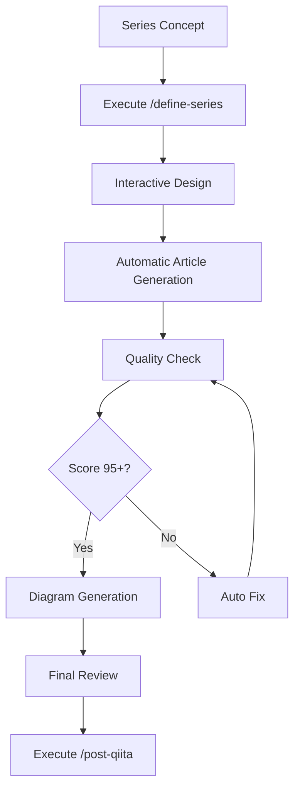

**Date:** 2025-08-06 | **Version:** 1.0

# Claude Code Best Practices Guide

## 🎯 Overview

This guide provides practical best practices for maximizing Claude Code's capabilities to create and publish technical articles with 100% generative AI assistance.

## 📋 Table of Contents

1. [Project Structure Optimization](#project-structure-optimization)
2. [Custom Commands Usage](#custom-commands-usage)
3. [Effective SubAgent Usage](#effective-subagent-usage)
4. [Permission Management Best Practices](#permission-management-best-practices)
5. [Article Creation Workflow Automation](#article-creation-workflow-automation)
6. [Quality Management Automation](#quality-management-automation)
7. [Token Efficiency Strategies](#token-efficiency-strategies)
8. [Troubleshooting](#troubleshooting)

## 🗂 Project Structure Optimization

### Recommended Directory Structure

```
article-agent/
├── CLAUDE.md                           # Project-wide guidelines
├── .claude/                            # Claude Code configuration
│   ├── config.json                     # Basic configuration
│   ├── settings.local.json             # Local permission settings
│   ├── commands/                       # Custom command definitions
│   ├── agents/                         # SubAgent definitions
│   └── config/                         # API tokens (.gitignore required)
├── articles/                           # Article management
│   ├── shared-templates/               # Shared templates (token reduction)
│   └── {SeriesName}/                   # Each series
├── personas/                           # Unified persona management
│   ├── individuals/                    # Individual persona definitions
│   ├── roles/                          # Role-specific behavior patterns
│   └── contexts/                       # Context-specific behavior patterns
└── internal/                           # Internal documentation
```

### File Naming Conventions

- **Series Names**: English only, CamelCase (e.g., `AIPersonaRoundtable`)
- **Article Names**: Number prefix with English (e.g., `1-AIHumanDistanceAnalysis`)
- **Internal Docs**: Lowercase, hyphen-separated (e.g., `claude-code-best-practices.md`)

## 🚀 Custom Commands Usage

### Main Commands List

| Command | Purpose | Usage Timing |
|---------|---------|--------------|
| `/define-series` | Create series structure & generate articles | New series start |
| `/update-series` | Update existing series | Article revision |
| `/generate-diagrams` | Batch generate Mermaid diagrams | After article completion |
| `/post-qiita` | Post to Qiita | Article publication |
| `/delete-qiita-series` | Delete Qiita articles | Article retraction |
| `/generate-tags` | Auto-generate tags | After article completion |
| `/define-persona` | Create persona | Character addition |

### Command Usage Best Practices

#### 1. Efficient Series Creation

```bash
# Step 1: Series definition and automatic article generation
/define-series "Claude Code Advanced Techniques"
# → Interactive series design
# → Automatic structure generation
# → Automatic writing of all articles
# → Automatic quality checks

# Step 2: Automatic diagram generation
/generate-diagrams
# → Batch generation of all Mermaid diagrams

# Step 3: Post after manual review
/post-qiita AIPersonaRoundtable
# → Individual posting of each article
```

#### 2. Article Update Automation

```bash
# Update existing articles
/update-series NextJSRenderingBattle
# → Batch update of entire series
# → Re-run quality checks
```

## 🤖 Effective SubAgent Usage

### SubAgent Usage Patterns

#### Quality Checker Agent

**Automatic Execution Timing**:
- After article generation
- During `/update-series` execution
- Manual execution: `/quality-check "path/to/article.md"`

**Main Functions**:
- Automatic removal of duplicate metadata
- Addition of TypeScript type definitions
- Markdown syntax error fixes
- Quality score calculation (target: 95/100)

#### Code Quality Checker Agent

**Purpose**:
- Type safety verification of code examples
- Best practices compliance check
- Performance issue detection

### SubAgent Design Points

1. **Single Responsibility Principle**: Each agent has one clear role
2. **Automatic Triggers**: Auto-execute at appropriate timing
3. **Inter-agent Cooperation**: Share data between agents
4. **Error Handling**: Appropriate failure processing

## 🔐 Permission Management Best Practices

### Optimizing settings.local.json

```json
{
  "permissions": {
    "allow": [
      // Essential commands
      "Bash(mkdir:*)",      // Directory creation
      "Bash(python:*)",      // Python execution
      "Bash(npm run:*)",     // npm scripts
      "Bash(git:*)",         // Git operations
      "Bash(mmdc:*)",        // Mermaid diagram generation
      
      // Custom commands
      "Bash(/post-qiita:*)", // Qiita posting
      
      // MCP integration
      "mcp__ide__executeCode"
    ],
    "deny": [
      // Explicitly deny dangerous commands
      "Bash(sudo:*)",
      "Bash(rm -rf:*)"
    ]
  }
}
```

### Security Considerations

1. **Principle of Least Privilege**: Grant only minimum necessary permissions
2. **Explicit Denial**: Add dangerous commands to deny list explicitly
3. **Regular Review**: Adjust permissions based on usage

## 📝 Article Creation Workflow Automation

### Efficient Workflow



### Task Management Utilization

```javascript
// Utilize Claude Code's TodoWrite feature
TodoWrite({
  todos: [
    { id: "1", content: "Create series structure", status: "completed" },
    { id: "2", content: "Write article 1", status: "in_progress" },
    { id: "3", content: "Write article 2", status: "pending" },
    { id: "4", content: "Quality check", status: "pending" },
    { id: "5", content: "Post to Qiita", status: "pending" }
  ]
});
```

## ✅ Quality Management Automation

### Automated Quality Check Flow

1. **Automatic Check After Article Generation**
   - Remove duplicate metadata
   - Add TypeScript type definitions
   - Fix Markdown syntax errors

2. **Quality Scoring**
   - Format Consistency: /100
   - Content Quality: /100
   - Technical Accuracy: /100
   - Overall Score: Average (Target: 95+)

3. **Auto-fix Categories**
   - `duplicate_metadata`: Metadata duplication
   - `typescript_types`: Missing type definitions
   - `markdown_syntax`: Syntax errors
   - `version_notation`: Version notation
   - `trailing_whitespace`: Trailing whitespace

### Quality Standards Configuration

```json
{
  "quality_standards": {
    "target_score": 95,
    "critical_threshold": 80,
    "auto_fix_enabled": true,
    "auto_fix_categories": [
      "duplicate_metadata",
      "typescript_types",
      "markdown_syntax",
      "version_notation",
      "trailing_whitespace"
    ]
  }
}
```

## 💡 Token Efficiency Strategies

### Shared Template Utilization

**Effect**: 25-35% token reduction

1. **series-common.md**: Character settings & common patterns
2. **optimized-format.md**: Token-efficient article format
3. **english-templates.md**: Reusable English templates

### Unified Persona System

**Benefits**:
- Multiple roles with one persona (author/reviewer/reader)
- Automatic character consistency maintenance
- Multi-perspective evaluation through role switching

### Duplication Reduction Through References

```markdown
# author.md example
Reference File: /articles/personas/individuals/tanukichi.md
Template: /articles/shared-templates/author.md

## Customization (Series-specific)
- **Focus Theme**: Claude Code utilization techniques
- **Special Style Adjustment**: More practical approach
```

## 🔧 Troubleshooting

### Common Issues and Solutions

#### 1. Command Cannot Execute

**Cause**: Insufficient permissions
**Solution**: 
```bash
# Add permission to settings.local.json
"allow": ["Bash(command:*)"]
```

#### 2. Low Quality Score

**Cause**: Template inconsistency
**Solution**:
```bash
# Manually execute quality check
/quality-check "articles/SeriesName/1-ArticleName/drafts/pages/article.md"
# Apply auto-fixes
```

#### 3. Qiita Posting Error

**Cause**: API token misconfiguration
**Solution**:
```bash
# Check token file
cat .claude/config/qiita-token.json
# Set in correct format
{"token": "your-api-token-here"}
```

#### 4. Diagram Generation Failure

**Cause**: Mermaid syntax error
**Solution**:
```bash
# Generate diagram individually to check error
mmdc -i diagram.mmd -o diagram.png -b white
```

### Debugging Tips

1. **Check Logs**: Read error messages in detail
2. **Step-by-step Execution**: Break down commands into smaller parts
3. **Permission Check**: Verify settings.local.json configuration
4. **File Paths**: Use absolute paths to avoid issues

## 📈 Performance Optimization

### Parallel Processing Utilization

```bash
# Simultaneous quality check of multiple articles
parallel /quality-check ::: article1.md article2.md article3.md
```

### Cache Utilization

- Keep shared templates in memory
- Reuse generated diagrams
- Cache persona settings

### Batch Processing

```bash
# Batch processing of entire series
/update-series SeriesName --batch --no-prompt
```

## 🎓 Advanced Usage Techniques

### 1. Hook Feature Utilization

For comprehensive Hook configuration and usage, see [Claude Code Hooks Guide](./claude-code-hooks-guide.md).

```json
{
  "hooks": {
    "pre-commit": "npm run lint && npm test",
    "post-article": "/quality-check ${article_path}",
    "pre-publish": "/generate-tags ${article_path}"
  }
}
```

### 2. MCP (Model Context Protocol) Integration

```json
{
  "mcp": {
    "ide": {
      "enabled": true,
      "features": ["diagnostics", "executeCode"]
    }
  }
}
```

### 3. Custom Workflows

```javascript
// Automate complex workflows
async function customWorkflow() {
  await defineSeries("NewSeries");
  await generateDiagrams();
  await qualityCheck();
  if (score >= 95) {
    await postToQiita();
  }
}
```

## 📚 Reference

### Important Files

- `/CLAUDE.md`: Project guidelines
- `/.claude/config.json`: Claude Code configuration
- `/.claude/settings.local.json`: Local permission settings
- `/articles/shared-templates/`: Shared templates

### Related Documentation

- [Custom Command Definition Guide](.claude/commands/)
- [SubAgent Design Patterns](.claude/agents/)
- [Persona Management Guide](personas/)

## 🚀 Next Steps

1. **Complete Basic Setup**: Configure CLAUDE.md and config.json
2. **Optimize Permissions**: Adjust settings.local.json
3. **Prepare Templates**: Create shared-templates
4. **Configure Personas**: Define unified personas
5. **Implement Automation**: Utilize custom commands and SubAgents

Use this guide as reference to maximize Claude Code's capabilities for efficient article creation.