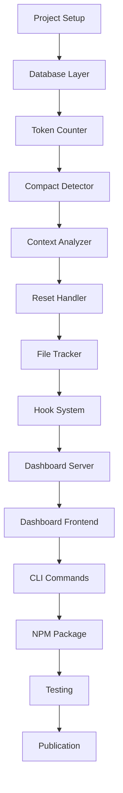

# Context Monitoring - Task Breakdown

**Date:** 2025-01-09 | **Version:** 1.0  
**Feature:** Context Monitoring System
**NPM Package:** claudecode-context-monitoring

## 📋 Implementation Tasks Overview

Total Estimated Time: **2 weeks (10 working days)**

## 🔨 Day 1-2: Core Infrastructure

### Task 1.1: Project Setup (2 hours)
```bash
# Create project structure
mkdir claudecode-context-monitoring
cd claudecode-context-monitoring
npm init
```
- [ ] Initialize NPM package
- [ ] Setup project structure
- [ ] Configure package.json
- [ ] Setup TypeScript configuration
- [ ] Configure ESLint and Prettier

### Task 1.2: Database Layer (3 hours)
```javascript
// src/data/database.js
```
- [ ] Install SQLite dependencies
- [ ] Create database schema
- [ ] Implement connection pool
- [ ] Create migration scripts
- [ ] Add data retention logic (7-day cleanup)

### Task 1.3: Token Counter Implementation (4 hours)
```javascript
// src/core/TokenCounter.js
```
- [ ] Install tiktoken dependency
- [ ] Implement HybridTokenCounter class
- [ ] Add Claude adjustment factor (1.1x)
- [ ] Implement fallback estimation
- [ ] Add LRU cache
- [ ] Write unit tests

### Task 1.4: Compact Detector (3 hours)
```javascript
// src/core/CompactDetector.js
```
- [ ] Implement CompactDetector class
- [ ] Add 30% threshold detection
- [ ] Implement event storage
- [ ] Add notification system
- [ ] Write unit tests

### Task 1.5: Language Analyzer (3 hours)
```javascript
// src/core/LanguageAnalyzer.js
```
- [ ] Implement LanguageAnalyzer class
- [ ] Add Japanese/English detection logic
- [ ] Calculate token costs per language
- [ ] Generate savings recommendations
- [ ] Track language statistics
- [ ] Write unit tests

## 🔨 Day 3-4: Context Management

### Task 2.1: Context Analyzer (4 hours)
```javascript
// src/core/ContextAnalyzer.js
```
- [ ] Implement ContextAnalyzer class
- [ ] Add threshold monitoring (80%, 90%)
- [ ] Integrate CompactDetector
- [ ] Add recommendation engine
- [ ] Write unit tests

### Task 2.2: Reset Handler (3 hours)
```javascript
// src/core/ResetHandler.js
```
- [ ] Implement reset command handling
- [ ] Add session archiving
- [ ] Implement counter clearing
- [ ] Handle different reset sources
- [ ] Write unit tests

### Task 2.3: File Tracker (3 hours)
```javascript
// src/core/FileTracker.js
```
- [ ] Implement file access logging
- [ ] Add redundancy detection
- [ ] Calculate token costs per file
- [ ] Generate caching recommendations
- [ ] Write unit tests

## 🔨 Day 5-6: Hook Integration

### Task 3.1: Hook System Setup (2 hours)
```javascript
// src/hooks/index.js
```
- [ ] Create hook registration system
- [ ] Implement priority handling
- [ ] Add error handling
- [ ] Setup hook configuration

### Task 3.2: User Input Hook (2 hours)
```javascript
// src/hooks/user-input-hook.js
```
- [ ] Capture user messages
- [ ] Count tokens
- [ ] Update session stats
- [ ] Write integration tests

### Task 3.3: Tool Call Hook (2 hours)
```javascript
// src/hooks/tool-call-hook.js
```
- [ ] Capture tool invocations
- [ ] Track file operations
- [ ] Count tool-related tokens
- [ ] Write integration tests

### Task 3.4: Session Hook (2 hours)
```javascript
// src/hooks/session-hook.js
```
- [ ] Handle session start/end
- [ ] Detect reset commands
- [ ] Track session boundaries
- [ ] Write integration tests

## 🔨 Day 7-8: Dashboard Development

### Task 4.1: Dashboard Server (4 hours)
```javascript
// src/dashboard/server.js
```
- [ ] Setup Express server
- [ ] Implement WebSocket server
- [ ] Add real-time update system
- [ ] Configure localhost-only access
- [ ] Add static file serving

### Task 4.2: Dashboard Frontend (4 hours)
```html
<!-- src/dashboard/index.html -->
```
- [ ] Create responsive HTML layout
- [ ] Implement Chart.js visualizations
- [ ] Add WebSocket client
- [ ] Create real-time updates
- [ ] Add alert notifications

### Task 4.3: Dashboard API (3 hours)
```javascript
// src/dashboard/api.js
```
- [ ] Create REST endpoints
- [ ] Add data aggregation
- [ ] Implement export functionality
- [ ] Add metrics calculation
- [ ] Write API tests

## 🔨 Day 9: CLI & NPM Package

### Task 5.1: CLI Commands (3 hours)
```javascript
// bin/context-monitor.js
```
- [ ] Implement init command
- [ ] Add start/stop commands
- [ ] Create status command
- [ ] Add config command
- [ ] Write CLI tests

### Task 5.2: NPM Package Setup (2 hours)
```json
// package.json configuration
```
- [ ] Configure main entry point
- [ ] Setup bin scripts
- [ ] Add dependencies
- [ ] Configure publishing settings
- [ ] Create .npmignore

### Task 5.3: Documentation (3 hours)
```markdown
// README.md
```
- [ ] Write installation guide
- [ ] Create quick start guide
- [ ] Document API reference
- [ ] Add troubleshooting section
- [ ] Create examples

## 🔨 Day 10: Testing & Polish

### Task 6.1: Integration Testing (3 hours)
- [ ] Test hook integration
- [ ] Test dashboard functionality
- [ ] Test CLI commands
- [ ] Test NPM installation
- [ ] Fix identified issues

### Task 6.2: Performance Testing (2 hours)
- [ ] Benchmark token counting speed
- [ ] Test dashboard latency
- [ ] Measure memory usage
- [ ] Optimize bottlenecks

### Task 6.3: Final Polish (3 hours)
- [ ] Code review and refactoring
- [ ] Update all documentation
- [ ] Prepare NPM publication
- [ ] Create GitHub release notes
- [ ] Final testing

## 📊 Task Dependencies



## 🎯 Critical Path

1. **Core Infrastructure** (Day 1-2) - Foundation
2. **Hook Integration** (Day 5-6) - Claude Code connection
3. **Dashboard** (Day 7-8) - User interface
4. **NPM Package** (Day 9) - Distribution
5. **Testing** (Day 10) - Quality assurance

## 📝 Risk Mitigation

### Technical Risks
- **tiktoken compatibility**: Have fallback estimation ready
- **Hook integration issues**: Test with minimal hooks first
- **WebSocket stability**: Implement reconnection logic
- **Database performance**: Use indexing and query optimization

### Schedule Risks
- **Buffer time**: 20% buffer included in estimates
- **Parallel work**: Some tasks can be done concurrently
- **Early testing**: Start testing from Day 1

## ✅ Definition of Done

Each task is considered complete when:
- [ ] Code implemented and working
- [ ] Unit tests written and passing
- [ ] Code reviewed and refactored
- [ ] Documentation updated
- [ ] Integration tested

## 🚀 Quick Start Commands

```bash
# Day 1: Setup
git clone [repo]
cd claudecode-context-monitoring
npm install

# Development
npm run dev
npm run test:watch

# Testing
npm test
npm run test:coverage

# Build
npm run build

# Local testing
npm link
context-monitor init

# Publication (Day 10)
npm publish
```

## 📈 Progress Tracking

Use TodoWrite tool to track daily progress:

```javascript
todos = [
  { id: "D1-1", content: "Project Setup", status: "pending" },
  { id: "D1-2", content: "Database Layer", status: "pending" },
  { id: "D1-3", content: "Token Counter", status: "pending" },
  // ... continue for all tasks
]
```

## 🎯 Success Metrics

- [ ] All core features implemented
- [ ] Test coverage > 80%
- [ ] Performance benchmarks met
- [ ] Documentation complete
- [ ] NPM package published
- [ ] Dashboard accessible and functional
- [ ] Zero critical bugs

---

## Version History

| Version | Date | Changes | Author |
|---------|------|---------|--------|
| 1.0 | 2025-01-09 | Initial task breakdown | Claude Code |