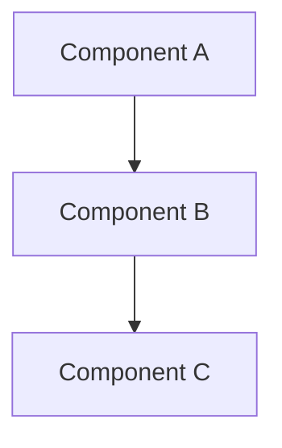
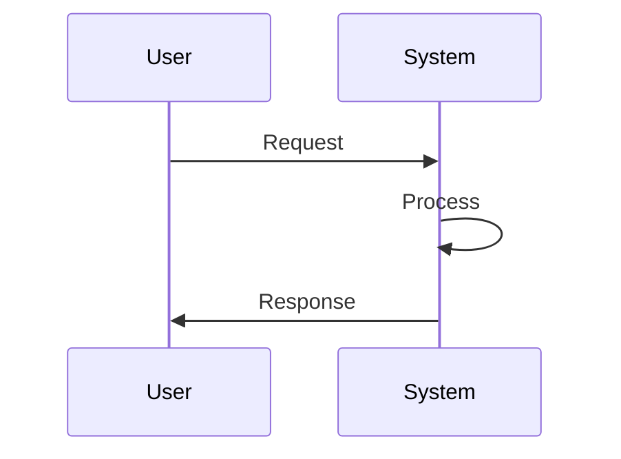

# Design Document Template

**Feature Name:** [Feature Name]  
**Date:** [YYYY-MM-DD]  
**Version:** 1.0  
**Author:** [Author Name]  
**Requirements Doc:** [Link to requirements]

## 1. Overview

### 1.1 Purpose
[Brief description of what this design achieves]

### 1.2 Scope
[What is included and excluded from this design]

### 1.3 Design Goals
- [Goal 1: e.g., Maintainability]
- [Goal 2: e.g., Performance]
- [Goal 3: e.g., Scalability]

## 2. Architecture

### 2.1 High-Level Architecture

[Describe the overall architecture]

### 2.2 Component Design

#### Component: [Component Name]
- **Purpose:** [What it does]
- **Responsibilities:** [List of responsibilities]
- **Interfaces:** [APIs/methods exposed]
- **Dependencies:** [What it depends on]

### 2.3 Data Flow


## 3. Detailed Design

### 3.1 Class/Module Structure
```typescript
interface FeatureInterface {
    method1(param: Type): ReturnType;
    method2(param: Type): ReturnType;
}

class FeatureImplementation implements FeatureInterface {
    // Implementation details
}
```

### 3.2 Database Design
| Table/Collection | Fields | Type | Constraints |
|-----------------|--------|------|-------------|
| [Table name] | id | UUID | PRIMARY KEY |
| | field1 | String | NOT NULL |
| | field2 | Integer | DEFAULT 0 |

### 3.3 API Design
#### Endpoint: [GET/POST/PUT/DELETE] /api/[endpoint]
- **Purpose:** [What it does]
- **Request:**
  ```json
  {
    "field1": "value",
    "field2": 123
  }
  ```
- **Response:**
  ```json
  {
    "status": "success",
    "data": {}
  }
  ```
- **Error Codes:**
  - 400: Bad Request
  - 401: Unauthorized
  - 500: Internal Server Error

## 4. Technology Stack

### 4.1 Languages and Frameworks
- Language: [e.g., TypeScript]
- Framework: [e.g., Node.js]
- Testing: [e.g., Jest]

### 4.2 Libraries and Dependencies
| Library | Version | Purpose | License |
|---------|---------|---------|---------|
| [Library name] | x.y.z | [Why needed] | [License type] |

### 4.3 Tools
- Build: [e.g., npm/yarn]
- Linting: [e.g., ESLint]
- Formatting: [e.g., Prettier]

## 5. Security Considerations

### 5.1 Authentication
[How users are authenticated]

### 5.2 Authorization
[How access control is implemented]

### 5.3 Data Protection
- Encryption: [At rest/in transit]
- Sensitive data handling: [Approach]
- Input validation: [Strategy]

### 5.4 Security Checklist
- [ ] No hardcoded secrets
- [ ] Input validation implemented
- [ ] SQL injection prevention
- [ ] XSS prevention
- [ ] CSRF protection
- [ ] Rate limiting

## 6. Performance Considerations

### 6.1 Expected Load
- Users: [Number]
- Requests/second: [Number]
- Data volume: [Size]

### 6.2 Optimization Strategies
- Caching: [Strategy]
- Database indexing: [Indexes needed]
- Async processing: [Where applicable]

### 6.3 Performance Targets
| Metric | Target | Measurement Method |
|--------|--------|-------------------|
| Response time | < 200ms | API monitoring |
| Memory usage | < 512MB | System metrics |

## 7. Error Handling

### 7.1 Error Types
| Error Type | Handling Strategy | User Message |
|------------|------------------|--------------|
| Validation Error | Return 400 with details | "Invalid input: [details]" |
| System Error | Log and return 500 | "An error occurred" |

### 7.2 Logging Strategy
- Level: [DEBUG/INFO/WARN/ERROR]
- Format: [Structured/Plain text]
- Destination: [File/Console/Service]

## 8. Testing Strategy

### 8.1 Unit Testing
- Coverage target: 80%+
- Framework: [e.g., Jest]
- Mock strategy: [Approach]

### 8.2 Integration Testing
- Scope: [What to test]
- Environment: [Test environment setup]

### 8.3 Performance Testing
- Tools: [e.g., Apache JMeter]
- Scenarios: [Load patterns to test]

## 9. Deployment

### 9.1 Environment Configuration
| Environment | Configuration | Purpose |
|------------|--------------|---------|
| Development | [Config] | Local development |
| Staging | [Config] | Pre-production testing |
| Production | [Config] | Live system |

### 9.2 Deployment Process
1. [Step 1]
2. [Step 2]
3. [Step 3]

### 9.3 Rollback Plan
[How to rollback if deployment fails]

## 10. Maintenance

### 10.1 Monitoring
- Metrics to track: [List]
- Alerting thresholds: [Values]

### 10.2 Documentation
- Code documentation: [Standards]
- User documentation: [What to create]
- API documentation: [Format]

## 11. Proof of Concept

### 11.1 PoC Scope
[What the PoC will demonstrate]

### 11.2 PoC Results
[Findings from PoC implementation]

### 11.3 Lessons Learned
[What was learned from PoC]

## 12. Approval

- [ ] Design reviewed
- [ ] Security review completed
- [ ] Performance requirements met
- [ ] Approved by: [Name]
- [ ] Approval date: [Date]

## Appendix

### A. Alternative Designs Considered
[Other approaches that were evaluated]

### B. References
- [Design patterns used]
- [External documentation]

### C. Change Log
| Version | Date | Changes | Author |
|---------|------|---------|--------|
| 1.0 | [Date] | Initial design | [Name] |